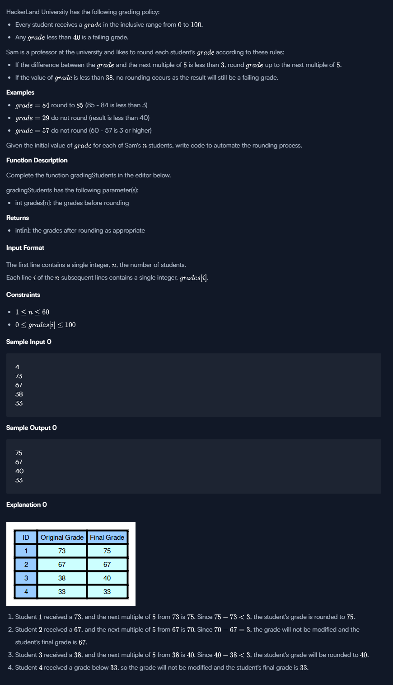

## Problem



## Code

```
'use strict';

const fs = require('fs');

process.stdin.resume();
process.stdin.setEncoding('utf-8');

let inputString = '';
let currentLine = 0;

process.stdin.on('data', function(inputStdin) {
    inputString += inputStdin;
});

process.stdin.on('end', function() {
    inputString = inputString.split('\n');

    main();
});

function readLine() {
    return inputString[currentLine++];
}

/*
 * Complete the 'gradingStudents' function below.
 *
 * The function is expected to return an INTEGER_ARRAY.
 * The function accepts INTEGER_ARRAY grades as parameter.
 */

function getDivisibleBy5(num) {
    console.log(num);
    if(num%5 == 0) {
        return num;
    } else {
        num = num+1;
        return getDivisibleBy5(num);
    }
}

function gradingStudents(grades) {
    // Write your code here
    
    let res = [];
    grades.forEach(function(grade,i) {
        if(grade<=35) {
            res.push(grade);
        } else {
            const divisible5 = getDivisibleBy5(grade);
            if((divisible5-grade) < 3) {
                res.push(divisible5);
            } else {
                res.push(grade);
            }
        }
    });
    
    return res;

}

function main() {
    const ws = fs.createWriteStream(process.env.OUTPUT_PATH);

    const gradesCount = parseInt(readLine().trim(), 10);

    let grades = [];

    for (let i = 0; i < gradesCount; i++) {
        const gradesItem = parseInt(readLine().trim(), 10);
        grades.push(gradesItem);
    }

    const result = gradingStudents(grades);

    ws.write(result.join('\n') + '\n');

    ws.end();
}


```