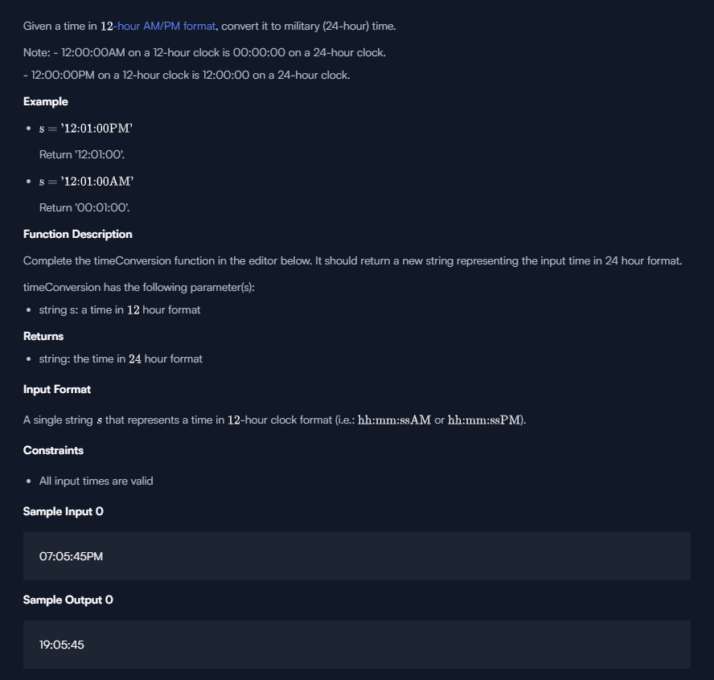

## Problem



## Code - Solutions 2

```
'use strict';

const fs = require('fs');

process.stdin.resume();
process.stdin.setEncoding('utf-8');

let inputString = '';
let currentLine = 0;

process.stdin.on('data', function(inputStdin) {
    inputString += inputStdin;
});

process.stdin.on('end', function() {
    inputString = inputString.split('\n');

    main();
});

function readLine() {
    return inputString[currentLine++];
}

/*
 * Complete the 'timeConversion' function below.
 *
 * The function is expected to return a STRING.
 * The function accepts STRING s as parameter.
 */

function timeConversion(s) {
    // Write your code here
    const who = s.substring(s.length-2, s.length);
    
    const times = s.substring(0,s.length-2);
    
    const dateObj = new Date("2011-10-10 "+times+" "+ who);
    
    return dateObj.getHours().toString().padStart(2,"0")+":"+dateObj.getMinutes().toString().padStart(2,"0")+":"+dateObj.getSeconds().toString().padStart(2,"0");
    
}

function main() {
    const ws = fs.createWriteStream(process.env.OUTPUT_PATH);

    const s = readLine();

    const result = timeConversion(s);


    ws.write(result + '\n');

    ws.end();
}

```

## Code - Solutions 1

```
'use strict';

const fs = require('fs');

process.stdin.resume();
process.stdin.setEncoding('utf-8');

let inputString = '';
let currentLine = 0;

process.stdin.on('data', function(inputStdin) {
    inputString += inputStdin;
});

process.stdin.on('end', function() {
    inputString = inputString.split('\n');

    main();
});

function readLine() {
    return inputString[currentLine++];
}

/*
 * Complete the 'timeConversion' function below.
 *
 * The function is expected to return a STRING.
 * The function accepts STRING s as parameter.
 */

function timeConversion(s) {
    // Write your code here
    const who = s.substring(s.length-2, s.length);
    let times = s.substring(0,s.length-2).split(":");
    if(who == "PM") {
        if(times[0] == 12) {
             times[0] = "12";
        } else
            times[0] = 12+parseInt(times[0]);
    } else if(times[0] == 12) {
             times[0] = "00";
    }
    return times.join(":");
}

function main() {
    const ws = fs.createWriteStream(process.env.OUTPUT_PATH);

    const s = readLine();

    const result = timeConversion(s);


    ws.write(result + '\n');

    ws.end();
}

```